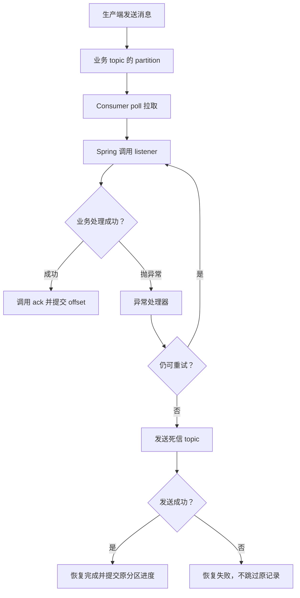

# Kafka 到 Spring Boot 编程：总体流程与配置手册

适用：Java 8、Spring Boot 2.6.15、Spring Kafka 2.8.11。

本文把 topic 准备、生产消息、并发消费、offset 提交、异常重试、死信处理串成一套可对照实现的流程。示例采用**非 Kafka 事务、逐条同步 listener、手动立即确认**。代码是教学骨架，业务持久化、认证信息需要接入自己的系统；未执行 Maven 编译或真实集群联调。

版本依据：[Spring Boot 2.6.15 依赖清单](https://docs.spring.io/spring-boot/docs/2.6.15/reference/html/dependency-versions.html)。此处选用旧版本是为了匹配已有 Java 8 / Boot 2.6 环境，不表示它是新项目的版本建议。

## 1. 先记住这六句话

1. Kafka topic 分成多个 partition；每个 partition 内的消息具有各自的 offset。
2. 同一个消费组内，一个 partition 同一时刻由一个 Consumer 消费；一个 Consumer 可以负责多个 partition。
3. Consumer 主动 poll 拉消息，Spring 容器再调用你的 listener。
4. 手动确认模式下，业务成功后调用 `ack.acknowledge()`；提交成功后，已提交 offset 才推进。
5. listener 抛异常先交给异常处理器，不是天然进入死信。
6. 死信是普通 topic；需要创建 topic，并在消费端配置失败消息转发逻辑。

## 2. 一条消息的全流程



图中行为对应本文配置。不可重试异常可以直接进入恢复阶段；提交操作自身也可能失败。实际失败重投由容器及错误处理器控制，不是 Kafka 服务器主动再次推送。

## 3. 每一方负责什么

| 所属方 | 配置或代码 | 作用 |
| --- | --- | --- |
| Kafka 集群管理 | broker 地址、网络、认证、ACL | 应用能够连接并拥有读写权限 |
| Kafka 集群管理 | topic、分区、副本、保留策略 | 决定数据布局与存储 |
| 原生产端 | KafkaTemplate、序列化、key、发送可靠性 | 把业务事件写入 Kafka |
| 消费端 | group、订阅 topic、concurrency、poll 参数 | 决定谁消费以及如何并发 |
| 消费端 | listener、业务服务、ack | 执行业务并确认进度 |
| 消费端 | DefaultErrorHandler、死信恢复器 | 重试以及转发失败消息 |
| 运维或独立补偿程序 | 死信查询、修复、重放、告警 | 让失败消息最终得到处理 |

原生产端通常不需要配置死信。消费端转发死信时，也在充当生产者，所以需要死信 topic 的写权限。

## 4. 第一步：规划并创建 topic

### 4.1 示例布局

假设有三个业务 topic，下面的分区数只是压测起点，不是吞吐保证。

| 业务 topic | 死信 topic | 每个 topic 分区数 | 副本数 |
| --- | --- | --- | --- |
| orders | orders.DLT | 6 | 3 |
| payments | payments.DLT | 6 | 3 |
| inventory | inventory.DLT | 6 | 3 |

本例死信转发保持原 partition 编号，所以死信 topic 的分区数至少与原 topic 一样多。

### 4.2 创建命令示例

以下命令在具备 Kafka CLI、网络和权限的环境中执行；示例要求至少三个 broker。单 broker 本地实验需将副本数和 `min.insync.replicas` 都改为 1。

```bash
for topic in orders payments inventory; do
  bin/kafka-topics.sh --bootstrap-server kafka1:9092 \
    --create --topic "$topic" --partitions 6 --replication-factor 3 \
    --config min.insync.replicas=2 \
    --config cleanup.policy=delete \
    --config retention.ms=604800000

  bin/kafka-topics.sh --bootstrap-server kafka1:9092 \
    --create --topic "${topic}.DLT" --partitions 6 --replication-factor 3 \
    --config min.insync.replicas=2 \
    --config cleanup.policy=delete \
    --config retention.ms=2592000000
done
```

示例将业务消息保留 7 天、死信保留 30 天，必须结合消息大小、峰值、可接受恢复窗口和磁盘容量调整。消息不是 ack 后就删除；delete 策略按保留条件与日志段清理，未消费消息也可能过期。

生产环境通常由平台提前建 topic，避免依赖自动创建的默认参数。Kafka 没有“开启死信”的特殊开关。自动创建是否有效还取决于 broker、客户端设置和权限。

### 4.3 上线前基础检查

- bootstrap 地址可达；broker 的 advertised 地址也必须能从应用环境访问。
- 生产者有业务 topic 写权限；消费者有业务 topic 和 group 读取权限。
- 消费应用有死信 topic 写权限；补偿程序有死信读取和自身 group 权限。
- 幂等生产权限应按集群版本和安全策略配置。
- 实际生产接入 SASL/TLS 时，通过受控配置注入凭据，不写进源码。

## 5. 第二步：引入依赖

`pom.xml`：

```xml
<project xmlns="http://maven.apache.org/POM/4.0.0"
         xmlns:xsi="http://www.w3.org/2001/XMLSchema-instance"
         xsi:schemaLocation="http://maven.apache.org/POM/4.0.0 https://maven.apache.org/xsd/maven-4.0.0.xsd">
    <modelVersion>4.0.0</modelVersion>
    <parent>
        <groupId>org.springframework.boot</groupId>
        <artifactId>spring-boot-starter-parent</artifactId>
        <version>2.6.15</version>
        <relativePath/>
    </parent>
    <groupId>com.example</groupId>
    <artifactId>kafka-demo</artifactId>
    <version>1.0.0</version>
    <properties>
        <java.version>1.8</java.version>
    </properties>
    <dependencies>
        <dependency>
            <groupId>org.springframework.boot</groupId>
            <artifactId>spring-boot-starter</artifactId>
        </dependency>
        <dependency>
            <groupId>org.springframework.kafka</groupId>
            <artifactId>spring-kafka</artifactId>
        </dependency>
    </dependencies>
    <build>
        <plugins>
            <plugin>
                <groupId>org.springframework.boot</groupId>
                <artifactId>spring-boot-maven-plugin</artifactId>
            </plugin>
        </plugins>
    </build>
</project>
```

不要混入仅适用于 Spring Kafka 3.x / 4.x 的代码。本版本 `KafkaTemplate.send()` 使用 `ListenableFuture`。

下文 Java 文件都放在 `src/main/java/com/example/kafka/`，每个 public 类一个同名文件。启动类：

```java
package com.example.kafka;

import org.springframework.boot.SpringApplication;
import org.springframework.boot.autoconfigure.SpringBootApplication;

@SpringBootApplication
public class KafkaDemoApplication {
    public static void main(String[] args) {
        SpringApplication.run(KafkaDemoApplication.class, args);
    }
}
```

## 6. 第三步：配置 Spring Boot

`src/main/resources/application.yml`：

```yaml
spring:
  kafka:
    bootstrap-servers: kafka1:9092,kafka2:9092,kafka3:9092
    producer:
      key-serializer: org.apache.kafka.common.serialization.StringSerializer
      value-serializer: org.apache.kafka.common.serialization.StringSerializer
      acks: all
      retries: 2147483647
      batch-size: 65536
      buffer-memory: 67108864
      compression-type: lz4
      properties:
        enable.idempotence: true
        max.in.flight.requests.per.connection: 5
        linger.ms: 5
        delivery.timeout.ms: 120000
        request.timeout.ms: 30000
    consumer:
      group-id: business-worker
      enable-auto-commit: false
      auto-offset-reset: earliest
      key-deserializer: org.apache.kafka.common.serialization.StringDeserializer
      value-deserializer: org.apache.kafka.common.serialization.StringDeserializer
      max-poll-records: 100
      properties:
        max.poll.interval.ms: 300000
        session.timeout.ms: 10000
        heartbeat.interval.ms: 3000
        allow.auto.create.topics: false
    listener:
      type: single
      concurrency: 3
      ack-mode: manual_immediate
      poll-timeout: 1000
      missing-topics-fatal: true
```

本例用字符串承载业务内容，把 JSON 解析放到业务方法中，简化反序列化失败路径。若改用 JsonDeserializer，应另行配置 ErrorHandlingDeserializer，并确保死信生产者能序列化反序列化失败时的原始字节。

### 6.1 生产者配置怎么理解

| 参数 | 本例含义 |
| --- | --- |
| acks=all | 等待当前 ISR 的确认，与最小 ISR 配置配合；不是消费者的 ack |
| enable.idempotence=true | 抑制生产者协议重试导致的重复，不等于业务全链路幂等 |
| retries / delivery.timeout.ms | 发送允许重试，但受总投递时间约束，并非无限等待 |
| batch-size / linger.ms | 聚合发送的批次大小和等待时间，平衡吞吐、延迟 |
| buffer-memory | 生产者缓冲预算；不能代替应用层限流 |
| compression-type | 压缩消息批次，减少网络和存储负担，消耗一定 CPU |

参数依据：[Kafka 生产者配置](https://kafka.apache.org/28/generated/producer_config.html)。数值是教学起点，需压测后调整。

### 6.2 消费者配置怎么理解

| 参数 | 本例含义 |
| --- | --- |
| group-id | 标识共同分担消费的成员及其提交进度 |
| enable-auto-commit=false | 禁用 Kafka 客户端定期自动提交，由 Spring 管理 |
| auto-offset-reset=earliest | 仅在没有有效已提交位置时采用最早可用位置，不是每次启动重读 |
| max-poll-records=100 | 一次 poll 最多返回 100 条，不限制底层全部预取内存 |
| max.poll.interval.ms | 两次 poll 间业务处理耗时的约束之一，超时可能失去分区所有权 |
| session / heartbeat | 心跳与故障检测相关超时，不能用来替代处理耗时控制 |
| concurrency=3 | 每个使用此工厂的 listener 容器建立 3 个子 Consumer |
| type=single | 逐条调用 listener，不是传入消息列表 |
| ack-mode | 控制提交进度的时机，与 listener 是否批量接收是两回事 |

Consumer 的位置与拉取行为参考：[KafkaConsumer API](https://kafka.apache.org/28/javadoc/org/apache/kafka/clients/consumer/KafkaConsumer.html)。

## 7. 第四步：编写生产端

```java
package com.example.kafka;

import org.springframework.kafka.core.KafkaTemplate;
import org.springframework.kafka.support.SendResult;
import org.springframework.stereotype.Service;
import org.springframework.util.concurrent.ListenableFuture;

@Service
public class EventPublisher {
    private final KafkaTemplate<String, String> template;

    public EventPublisher(KafkaTemplate<String, String> template) {
        this.template = template;
    }

    public ListenableFuture<SendResult<String, String>> publish(
            String topic, String businessKey, String payload) {
        return template.send(topic, businessKey, payload);
    }
}
```

调用方必须观察返回 future 的成功/失败，或者使用可靠 Outbox 补发机制。异步 send 返回不代表 broker 已经确认；只打印失败日志也不等于消息已经补偿。

设计建议：

- 消息包含稳定的 eventId、业务主键、事件类型、schemaVersion、发生时间。
- 对需要顺序处理的同一业务实体使用相同 key；分区数量不变且分区策略一致时可落到同一分区。
- 同 key 不等于无限扩容后的永久分区不变；扩分区前评估顺序影响。
- 数据库更新和发送 Kafka 不是天然原子操作；不能靠 producer 幂等解决双写问题。

## 8. 第五步：配置重试、死信与恢复提交

```java
package com.example.kafka;

import org.apache.kafka.common.TopicPartition;
import org.springframework.boot.autoconfigure.kafka.ConcurrentKafkaListenerContainerFactoryConfigurer;
import org.springframework.context.annotation.Bean;
import org.springframework.context.annotation.Configuration;
import org.springframework.kafka.config.ConcurrentKafkaListenerContainerFactory;
import org.springframework.kafka.core.ConsumerFactory;
import org.springframework.kafka.core.KafkaTemplate;
import org.springframework.kafka.listener.ContainerProperties;
import org.springframework.kafka.listener.DeadLetterPublishingRecoverer;
import org.springframework.kafka.listener.DefaultErrorHandler;
import org.springframework.util.backoff.FixedBackOff;

@Configuration
public class KafkaConsumerConfig {

    @Bean
    public DefaultErrorHandler kafkaErrorHandler(KafkaTemplate<String, String> template) {
        DeadLetterPublishingRecoverer recoverer =
                new DeadLetterPublishingRecoverer(template,
                        (record, exception) -> new TopicPartition(
                                record.topic() + ".DLT", record.partition()));

        // 等待发送结果；失败必须抛出，不能当作已恢复。
        recoverer.setFailIfSendResultIsError(true);

        // 首次执行 + 最多 2 次重试；每次重试退避 1 秒。
        DefaultErrorHandler handler =
                new DefaultErrorHandler(recoverer, new FixedBackOff(1000L, 2L));

        // 配合 MANUAL_IMMEDIATE：死信恢复成功后提交原记录进度。
        handler.setCommitRecovered(true);
        return handler;
    }

    @Bean
    public ConcurrentKafkaListenerContainerFactory<Object, Object>
            kafkaListenerContainerFactory(
                    ConcurrentKafkaListenerContainerFactoryConfigurer configurer,
                    ConsumerFactory<Object, Object> consumerFactory,
                    DefaultErrorHandler kafkaErrorHandler) {

        ConcurrentKafkaListenerContainerFactory<Object, Object> factory =
                new ConcurrentKafkaListenerContainerFactory<>();
        // 保留 application.yml 中 Boot 的 listener 配置。
        configurer.configure(factory, consumerFactory);
        factory.getContainerProperties().setAckMode(
                ContainerProperties.AckMode.MANUAL_IMMEDIATE);
        factory.getContainerProperties().setSyncCommits(true);
        factory.setCommonErrorHandler(kafkaErrorHandler);
        return factory;
    }
}
```

这里明确选用 MANUAL_IMMEDIATE。若以后切换到 BATCH，必须同步修改工厂和 listener 签名，重新评估恢复提交语义，不能只改 YAML。

普通可重试异常最多执行 3 次；框架默认认定的某些致命异常可能直接恢复，不走完整重试次数。未配置死信恢复器时，不会天然转发到 DLT。

依据：[DefaultErrorHandler API](https://docs.spring.io/spring-kafka/docs/2.8.11/api/org/springframework/kafka/listener/DefaultErrorHandler.html)。

死信发送成功与原 offset 提交在本例中不是一个原子事务：若发送成功后宕机、还没提交，可能再次发送死信。死信处理也要幂等。开启等待发送结果是为了避免把已知发送失败当作恢复成功，不是消除所有崩溃窗口。

依据：[DeadLetterPublishingRecoverer API](https://docs.spring.io/spring-kafka/docs/2.8.11/api/org/springframework/kafka/listener/DeadLetterPublishingRecoverer.html)。

## 9. 第六步：编写 listener

```java
package com.example.kafka;

import org.apache.kafka.clients.consumer.ConsumerRecord;
import org.springframework.kafka.annotation.KafkaListener;
import org.springframework.kafka.support.Acknowledgment;
import org.springframework.stereotype.Component;

@Component
public class BusinessListener {
    private final BusinessService service;

    public BusinessListener(BusinessService service) {
        this.service = service;
    }

    @KafkaListener(topics = {"orders", "payments", "inventory"})
    public void onMessage(ConsumerRecord<String, String> record,
                          Acknowledgment ack) {
        service.process(record.topic(), record.key(), record.value());
        // 业务同步完成后再确认；异常会使执行跳过这一行。
        ack.acknowledge();
    }
}
```

用于联调的业务占位实现，不代表真实业务已持久化：

```java
package com.example.kafka;

import org.slf4j.Logger;
import org.slf4j.LoggerFactory;
import org.springframework.stereotype.Service;

@Service
public class BusinessService {
    private static final Logger log = LoggerFactory.getLogger(BusinessService.class);

    public void process(String topic, String key, String payload) {
        if ("FAIL".equals(payload)) {
            throw new IllegalStateException("模拟业务处理失败");
        }
        // 替换为真实业务；不要在生产中记录含敏感信息的完整 payload。
        log.info("demo handled topic={}, key={}", topic, key);
    }
}
```

正式业务建议把数据库事务放在独立 service 的公开方法上，通过 Spring 代理调用，确保方法返回时事务已提交，再 ack。需要自行增加数据库依赖、数据源、事务及幂等实现。

不要把 ack 放在 finally 中。不要捕获业务异常仅打印日志后继续 ack。也不要在 listener 里把任务扔进线程池就直接返回和确认。

## 10. offset 到底什么时候推进

### 10.1 两个位置不是一回事

假设一个分区本次返回 offset 100、101、102：

| 位置 | 示例 | 含义 |
| --- | --- | --- |
| Consumer position | 103 | 下一次拉取位置，poll 返回消息后已经可以前进 |
| committed offset | 100 | 该组保存的恢复位置，尚未确认这些消息 |

处理完 100，提交的是 101：表示从 101 继续，而不是表示“101 已处理”。offset 提交不会删除消息，也不是每条消息独立标记。

### 10.2 四种模式对照

| 模式 | 正常路径 |
| --- | --- |
| RECORD | listener 每条正常返回后，由容器提交 |
| BATCH（默认） | 一次 poll 的记录全部处理完成后，由容器提交 |
| MANUAL | 手动 ack 后按批次语义安排提交，不一定立即 |
| MANUAL_IMMEDIATE | 在 Consumer 线程调用 ack 时立即发起提交 |

默认模式并不是框架替你调用 listener 参数中的 ack；框架直接管理提交。此处说的默认 BATCH，以未覆盖默认配置且关闭 Kafka 客户端自动提交为前提。

依据：[Spring Kafka 容器提交规则](https://docs.spring.io/spring-kafka/reference/kafka/receiving-messages/message-listener-container.html)。

### 10.3 本例的行为

| 发生什么 | 结果 |
| --- | --- |
| 100 业务成功，ack 提交成功 | committed offset 变成 101 |
| 101 业务抛异常，执行不到 ack | 进入重试，不通过本次 ack 跳过 101 |
| 101 重试成功，ack 提交成功 | committed offset 变成 102 |
| 101 重试耗尽，死信恢复成功，恢复提交成功 | committed offset 变成 102 |
| 死信发送失败，恢复器抛异常 | 不把 101 当作成功恢复来跳过 |
| 先 ack 且提交成功，后业务失败 | 已提交位置不会因异常自动撤销 |
| 业务成功，但 ack 提交失败或宕机 | 恢复后可能重复处理，必须业务幂等 |

不要以为“不 ack 就会立即自动重试”。手动模式若吞掉异常且不 ack，容器仍可能继续处理其他消息；随后提交更大的分区 offset 可能覆盖前面的失败位置。

## 11. concurrency 和线程怎么理解

本例是**一个 listener 订阅三个 topic，concurrency=3**，不是三个 topic 各创建 3 个 Consumer。若拆成三个独立 listener 且每个 concurrency=3，则通常共 9 个子 Consumer。

| 场景（单 topic） | 分配结果 |
| --- | --- |
| 1 个 partition，concurrency=3 | 只有 1 个 Consumer 有分区可消费，其余空闲 |
| 3 个 partition，concurrency=3 | 可各负责 1 个分区 |
| 10 个 partition，concurrency=3 | 每个 Consumer 负责多个分区，例如 4/3/3 |

多 topic 的具体分配取决于订阅和分配策略，不保证每种布局都均匀。实例数 × 每实例 concurrency 决定组内 Consumer 总量，但有效并行度受分区约束。

默认同步模型中，子容器的 Consumer 线程执行 poll 和 listener；不是 poll 线程先拉取，再自动交给业务线程池。一个 Consumer 负责的多个分区共享这个处理线程，慢消息和阻塞重试会影响这些分区。

同一个 Spring 单例 listener 可能被多个线程并发调用，不要把当前消息、临时集合等保存在可变实例字段中。KafkaConsumer 本身不能随意跨线程操作。

如果自行异步处理，需要设计有界队列、分区顺序、暂停恢复、异常回传和提交缺口。Spring Kafka 2.8 的 asyncAcks 能延迟有缺口的乱序提交，但不自动解决整个异步消费系统；本文不启用它。

依据：[乱序手动确认](https://docs.spring.io/spring-kafka/reference/kafka/receiving-messages/ooo-commits.html)。

## 12. 死信消息由谁处理、何时处理

本例只配置死信写入，不自动启动死信业务消费者，避免在没有补偿策略时将死信又确认掉。

建议实施流程：

1. 监控每个 DLT 的新增速率并告警。
2. 记录 eventId、原 topic/partition/offset、异常、时间和处理状态。
3. 区分坏数据、代码缺陷、外部依赖故障；修复后再重放。
4. 重放保留稳定 eventId，并限制批量、速率和尝试次数。
5. 如独立消费 DLT，使用自己的 group；持久化补偿任务成功后才确认 DLT 进度。

不要直接给 DLT listener 复用本文的死信工厂，否则可能形成 `.DLT.DLT` 链。需单独定义失败时停止、告警或可靠保存的策略。死信恢复让原分区继续，但原业务顺序不再完整：后面的事件可能先完成。

### 12.1 先区分“收集死信”和“重新执行业务”

死信由自己编写的死信消费者或补偿程序处理。Kafka 不会自动选择时间重新执行业务。

推荐把处理分为两个阶段：

1. **及时收集**：死信消费者持续监听 DLT，可靠保存消息和异常，登记待补偿任务并告警。
2. **择机补偿**：故障恢复、代码修复或数据审核后，再由自动任务或人工操作触发业务补偿。

收到死信不代表应当立即重试原业务。失败原因尚未消除时，无间隔重放通常只会再次失败。

### 12.2 死信 listener 示例

以下是扩展示意，未接入前面的可运行骨架；需要自行实现 `failedMessageService` 和独立的 `dltContainerFactory`。

```java
@KafkaListener(
    topics = "orders.DLT",
    groupId = "orders-dlt-handler",
    containerFactory = "dltContainerFactory"
)
public void onDeadLetter(ConsumerRecord<String, String> record,
                         Acknowledgment ack) {
    // 幂等保存消息、来源、异常和待处理状态。
    // 通过独立 Spring service 的事务方法完成，事务提交后才返回。
    failedMessageService.saveForLater(record);

    // 表示“死信已可靠登记”，不是“原业务已成功”。
    ack.acknowledge();
}
```

独立工厂使用手动立即确认及自己的失败策略。保存失败时应抛出异常，进入明确的重试或停止告警流程；不要吞掉异常、无条件确认，也不要用默认有限重试后仅记录日志并跳过的行为代替可靠保存。

`orders-dlt-handler` 提交的是它在 `orders.DLT` 上的消费进度，不是原消费组在 `orders` 上的进度。保存成功后，数据库中的补偿任务负责后续生命周期，因此不需要一直扣住 DLT 的 ack 等待几小时后的修复。

死信恢复器可附加原 topic、partition、offset 和异常等 headers。保存时同时记录 DLT 自身的位置、稳定 eventId、原始内容、失败时间和处理状态；用合适的唯一键避免重复登记。DLT 自身位置只能去重同一条 DLT 记录，不能代替业务 eventId 去重多次转发的相同事件。

参考：[Spring Kafka 死信记录与 headers](https://docs.spring.io/spring-kafka/docs/2.8.11/reference/html/#dead-letters)。

### 12.3 何时补偿：按原因决定

| 失败原因 | 处理时机 | 处理方式 |
| --- | --- | --- |
| 数据库或下游暂时不可用 | 依赖恢复后 | 自动限速重试，避免恢复瞬间压垮下游 |
| 消费代码有 bug | 修复并部署后 | 选择受影响范围，批量重放 |
| 字段错误或缺失 | 修正并审核后 | 发送修正后的事件或执行明确的业务补偿，保留审计 |
| 无效、过期的事件 | 人工或规则确认后 | 记录原因并终止，不强行重试 |

定时任务可以定期扫描“已到重试时间”的任务，但不是每隔一段时间无差别重放所有死信。多实例补偿程序要有任务领取机制，避免同一任务被并发执行。

### 12.4 完整时间例子

假设订单 A 因数据库故障，多次失败后进入 `orders.DLT`：

| 时间或阶段 | 动作 | 状态含义 |
| --- | --- | --- |
| 10:00 | DLT listener 保存 A 为待补偿任务，提交 DLT 进度并告警 | 失败信息已保管，原业务尚未成功 |
| 10:05 | 数据库恢复，补偿任务领取 A | 正在补偿 |
| 重新发送到 orders，broker 确认成功 | 原 listener 将再次处理 A | 只能标记“已重放”，不能直接标记“业务完成” |
| 原 listener 最终完成业务 | 通过业务状态或结果事件确认 | 业务完成 |
| 再次失败 | 记录次数、原因和下次执行时间 | 延后重试或转人工 |

也可以不重新发送 Kafka，而由补偿服务直接调用同一业务服务；此时仍需遵守业务校验、事务、幂等与权限边界。两条路径选择一条明确的方案，避免重复触发。

### 12.5 必须守住的边界

- **幂等**：重复补偿不能重复扣款、重复入库；通常保留稳定 eventId。修正事件若表达新语义，应明确新旧事件关联及去重规则。
- **有上限**：记录跨重放的累计次数和截止时间。重新发回原 topic 后，一轮新的框架重试可能重新计数，不能只依赖单轮错误处理器次数避免死循环。
- **有审计**：保留失败原因、处理状态、重放时间和人工操作记录。
- **考虑顺序**：后续消息可能已经完成，重放不能假设仍然符合原事件顺序。
- **考虑过期**：死信也受保留策略影响，应在过期前可靠收集；数据库中的失败记录同样需要保留与清理策略。
- **避免错误完成状态**：发送重放消息成功不等于消费业务成功；需要查询业务状态或接收处理结果闭环。

总结：**先及时收集和告警，等失败原因消除后，再有控制地补偿。**

## 13. 每小时千万条：如何估算而不是拍分区数

如果三个 topic **合计**每小时 1000 万条，平均约 2778 条/秒；若**每个** topic 都是每小时 1000 万条，则合计约 8333 条/秒。必须先区分口径，并额外考虑峰值。

粗略估算同步消费所需的活跃线程数：

`所需活跃线程 ≈ 峰值消息数/秒 × 平均单条处理秒数 ÷ 目标利用率`

示例：以 2778 条/秒、每条 10ms、利用率 70% 估算，需要约 40 个活跃处理线程。这个算例说明：本文 3 个线程和每 topic 6 个分区只是功能演示，不能凭配置承诺千万级业务吞吐。

实施时按每个 topic 的峰值、耗时分布、key 热点分别压测。增加 Consumer 前检查分区是否足够；增加业务并发前检查数据库连接池、HTTP 下游和限流容量。

同步模式下，一次 poll 的处理耗时需要留出充足余量，覆盖数据库尾延迟、GC、发送死信及故障路径。不要简单把 max.poll.interval.ms 调得极大来掩盖慢处理。

拉模型帮助消费者控制节奏，但不是端到端自动背压：消费变慢时 lag 仍会增长，保留窗口仍会到期。应用内无界队列会把压力转为堆内存风险。

## 14. 幂等与可靠性底线

建议以 eventId 或明确的业务唯一键实施幂等。对数据库副作用，可以在同一个本地事务内完成“去重登记 + 业务更新”，成功提交后再 ack；重复键处理应按数据库及事务框架特性实现。

需要区分：

- producer acks：broker 对写入的确认。
- consumer ack：应用通知 Spring 可以提交消费进度。
- producer 幂等：协议层发送重试去重。
- 业务幂等：重复消费不造成重复扣款、重复入库等副作用。

Kafka 事务可以用于特定 Kafka 读写链路，但不会自动让任意数据库、HTTP 副作用一起原子提交。本文是至少一次思路，不能宣称端到端 exactly-once。

## 15. 联调与验收清单

以下是待执行的测试清单，不是本文已经完成的测试结果。

- [ ] 六个 topic 已创建，分区、副本、保留策略正确。
- [ ] 发普通消息，确认业务执行成功并看到已提交 offset 前进。
- [ ] 发 payload=`FAIL`，观察首次失败和 2 次重试，然后在对应 DLT 找到消息。
- [ ] 验证死信记录带有原消息来源及异常相关 headers。
- [ ] 在隔离测试环境使死信发送失败，确认不会按成功恢复跳过原记录。
- [ ] 模拟业务完成后、ack 前宕机，验证重复消费的业务幂等。
- [ ] 多实例启动，检查分区分配和 listener 并发安全。
- [ ] 压测慢数据库、热 key、broker 不可用、滚动重启与 rebalance。
- [ ] 监控 lag、处理 P95/P99、重试率、死信率、提交失败、磁盘和 ISR。
- [ ] 保留窗口覆盖最长故障与补偿时间；有人工操作流程和审计。

常用只读检查：

```bash
bin/kafka-topics.sh --bootstrap-server kafka1:9092 \
  --describe --topic orders

bin/kafka-consumer-groups.sh --bootstrap-server kafka1:9092 \
  --describe --group business-worker
```

`CURRENT-OFFSET` 可用于查看已提交进度，`LOG-END-OFFSET` 是日志末端位置，`LAG` 是两者差距。位点差值不总等于可见业务消息条数，例如日志压缩和事务记录可能影响直觉。

## 16. 最后用一段话串起来

先在 Kafka 准备业务 topic 和死信 topic；生产端把事件发到业务 topic；Spring 创建 Consumer 拉取消息，再调用 listener。业务成功后按确认模式提交进度；业务抛异常交给异常处理器。本文配置会重试，耗尽后由消费端发送到死信 topic，发送和恢复提交成功后继续消费。死信由独立补偿流程治理，整个链路通过业务幂等承受重试和故障造成的重复。

> 最重要的顺序：**业务持久化成功 → 确认 → offset 提交成功。失败则交给明确配置的重试与恢复流程。**
